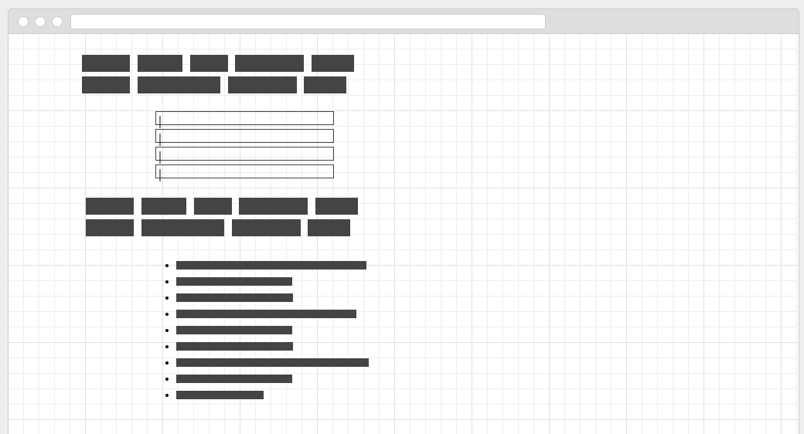
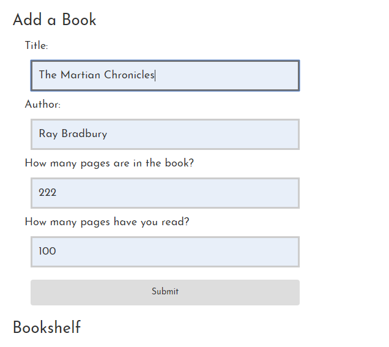
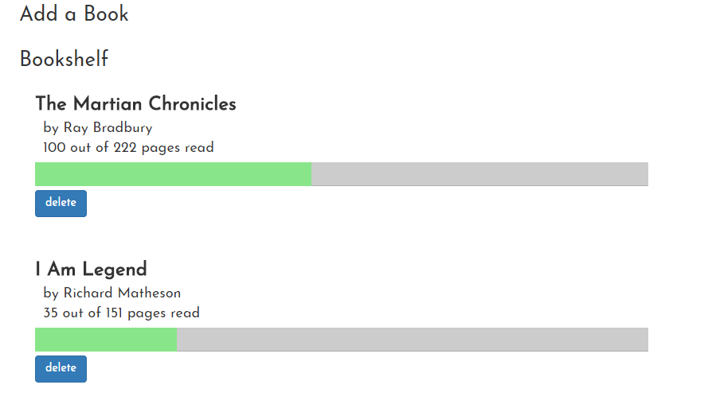

## Links

* [Home](https://ridethatcyclone.github.io/)
* [Assignment Page](http://www.wou.edu/~morses/classes/cs46x/assignments/HW2.html)
* [Code Repository](https://github.com/ridethatcyclone/CS460/tree/master/HW2)
* [Final Site](https://ridethatcyclone.github.io/CS460/hw2/index.html)

## The Assignment

We were tasked with creating an interesting and useful page using Javascript and JQuery as well as the skills we used on the last assignment (HTML, CSS, and Bootstrap). I decided to create a book tracker, as that's something that I personally would find useful and can never seem to find one that fits my needs.

I didn't want to bog myself down too much with overall appearance so I decided to go as minimalistic as I could convince myself to. Normally I prefer to put a lot of time into the design of a page, but it's not something I'm overly skilled at so I usually end up just slowing myself down. Since I haven't used a lot of Javascript before I wanted to make sure I focused more on that than making the page as pretty as can be. To that end, my basic layout is simply a plain page with two options on it, 'Add Book' and 'Bookshelf'. This was my mockup:



Each of these is a button, and using Javascript I later animated them to slide to reveal the information they're connected to. So when the user clicks on 'Add a Book', a form slides into place for them to type in the book's information and submit. When they click on 'Bookshelf', a list of all their previously submitted books appears.

Doing this was fairly easy. I was actually pleasantly surprised by how simple it was. My HTML setup in the body element is just one column in Bootstrap, and within that column the structure looks like:

```html
<ul class="b-menu">

    <!-- ADD A BOOK -->
    <li class="btn-default options add-book">Add a Book</li>
    <div class="add-form">
        <form id="add">
            Title:<br/>
            <input type="text" name="title" id="titleIn"/><br />
            Author:<br />
            <input type="text" name="author" id="authorIn"/><br />
            How many pages are in the book?<br />
            <input type="number" name="totalPages" id="totalPagesIn"/><br />
            How many pages have you read?<br />
            <input type="number" name="pagesRead" id="pagesReadIn"/><br />
            <button type="button" class="btn btn-elegant submit-btn" >Submit</btn>
        </form>
    </div>

    <!-- BOOKSHELF -->
    <li class="btn-default options bookshelf-btn">Bookshelf</li>
        <div class="bookshelf">
            <!-- BOOKS TO BE INSERTED HERE -->
        </div>

</ul>
```
I started with an unordered list and each header/button is a list item within that. Each of them uses the btn-default class from Bootstrap, an options class to unite them, and then a more unique class. This allowed me a lot of flexibility styling them, even if it makes the tags a little silly looking.

Within the Add section is a form with four fields: Title, Author, Total Pages, and Pages Read. The submit button is the fifth object contained. I had some trouble with the page auto refreshing (and thus, losing my submitted form data) when I used `<input type="submit">`, so I switched over to a button instead. Since it doesn't have actual input anyway, this wouldn't get in the way of resetting my form later on.

Finally, the Bookshelf section contains only the header/button and a div with the class bookshelf. This I left empty, as it will be filled by the form and Javascript later on.

I styled the form to be simple but large, so the page doesn't seem *too* plain. Specifically I widened all the text boxes, added some padding, and gave it a border that darkens when focus is on a field:

```css
input {
    width:40%;
    margin:10px;
    padding:10px;
}

input[type=text],input[type=number] {
    border:3px solid #ccc;
    -webkit transition:0.5s;
    transition:0.5s;
    background-color: #e8eff9;
}

.submit-btn {
    width:40%;
    margin:10px;
    padding: 10px;
}

input:focus {
    border: 3px solid #555;
}
```

To make the menu options (Add a Book and Bookshelf) look like actual menu options, I simply made them display in blocks, got rid of the list styling, and made them larger. `display:block` also allowed them to act as buttons rather than just plain text.

```css
.options {
    font-size: 26px;
    list-style-type: none;
    display: block;
    padding: 10px;
}
```

Then, for aesthetics, I moved the form and bookshelf over and made it larger and easier to read:

```css
.add-form, .bookshelf {
    margin-left: 30px;
    font-size: 18px;
}
```

Now that I had everything styled the way I wanted it, it was time to move on to the Javascript side of things. First thing, I wanted the headers to scroll open and closed when clicked. To do this I simply created an on click event in the `main()` function in my main.js file.

```Javascript
function main() {
    $('.add-form').hide();
    $('.bookshelf').hide();
    $('.options').on('click', function() {
        $(this).next().slideToggle(400);
    })
}

$(document).ready(main);
```

This was the basis for my Javascript file. Before I could toggle the two sections I had to make sure that they were hidden. With Bookshelf, it wasn't as vital as the page doesn't save information after the user refreshes, so there's never any information to hide. But with the idea that that functionality may be added later, I decided to hide it anyway. Then I simply added an on click function to the 'options' class, which both headers area members of. I didn't want to toggle the headers themselves however, which is why I did `$(this).next()` - Javascript would then toggle the next element instead of the one clicked on. In this case, the divs either header is referring to.

The most difficult part of the Javascript was getting the information from the form and onto the Bookshelf. I wrote a separate function in my main.js file to deal with that, but a lot of factors had to be considered. All fields were necessary, the numbers couldn't be negatives, etc. First I made sure it would accept the info as given into the fields at all. My basic framework of the function was this:

```Javascript
function submitNewBook() {
    var title = document.getElementById('titleIn').value;
    var author = document.getElementById('authorIn').value;
    var totalPages = document.getElementById('totalPagesIn').value;
    var pagesRead = document.getElementById('pagesReadIn').value;

    console.log("Title: " + title + ", Author: " + author + ", \
    Total Pages: " + totalPages + ", Pages Read: " + pagesRead);
}
```

Once I confirmed that that was working, I started adding conditionals:

```Javascript
function submitNewBook() {
    . . .
    if (pagesRead < 0 || totalPages < 0) {
        alert("Invalid input; pages must be greater than 0");
        return;
    }
    else if (pagesRead > totalPages) {
        alert("Pages read can't be greater than total pages");
        return;
    }
    else if (title.length === 0 || author.length === 0 || isNaN(totalPages) || isNaN(pagesRead)) {
        alert("Invalid input");
        return;
    }
    else {
        . . .
    }

}
```

I ran into an issue while I was testing these, however. It would allow any input into the number fields, regardless of what my conditionals demanded. I ended up discovering the issue to be the `.value` part of my code. Every time I was pulling the numbers from the input fields, despite the fact that the input fields were number types, it was pulling them as strings. To remedy this, I simply switched to `var totalPages = document.getElementById('totalPagesIn').valueAsNumber`. This fixed the problem and the conditionals started working as intended.

Adding the information back to the page is where things got extra complicated. I tried to use the append method to simply add a div in, but that got complex trying to write it within the Javascript. So instead I mocked up what it should look like on my HTML file and adjusted that over for Javascript. The basic HTML itself looks something like this:

```html
<div class='book'>
    <dl>
        <dt class='dtTitle'>Title</dt>
        <dd>by Author</dd>
        <dd>X out of Y pages read</dd>
    </dl>
</div>
```

I used a description list to achieve this, with a little bit of extra styling in the background. But I wanted to add more to this. Specifically, a progress bar and edit and delete buttons. I started with the progress bar, as I figured that would likely be the easiest way to do it. To create the progress bar, I simply made two nested divs that were the same height but different widths, and filled them in different colors. So for a progress bar showing the book is 60% read, the HTML would look like:

```html
<div style="width:100%; background-color:#ccc; height:30px;">
    <div style="width:60%; background-color:#89e589; height:30px;">
    </div>
</div>
```

Finally, I added a button to delete the book. I also wanted to add an edit button to change the values, but for the purposes of this assignment I considered that a little out of scope. Perhaps in a future feature update. For the delete button I used a simple Boostrap button class:

```html
<div class='editButtons btn-group'>
    <button class='btn btn-primary delete-btn'>delete</button>
</div>
```

I wrapped it in a `btn-group` class with the hopes that I will later be able to add the edit button and functionality in.

Just having these sections wasn't quite enough though, as they also needed to be able to function. The percentage needed to adjust based on the inputs given by the user, and the delete button needed to be able to remove books when prompted. For the percentage bar it was easy enough to use the variables I had created to pull my data from the forms to come up with a percentage and use that as the width percentage. (`var percentage = pagesRead/totalPages * 100;`) For the delete button I struggled a bit more. First I needed to make sure the user really wanted to delete the book. To do this I used the `confirm` method to pop up a window the user could interact with. Once I had that working, I enclosed it in an if statement, where if the user confirmed that they had meant to do that, it would remove the closest element with the 'book' class. Initially I tried to just stack parentElement calls, but Javascript didn't appreciate it. The code as it would look in Javascript is:

```Javascript
$('.delete-btn').on('click', function() {
    if (confirm('Are you sure?')) {
        $(this).closest('.book').remove();
    }
    else return false;
})
```

Finally, once I had both of those working, I wrapped everything together into an `append` statement in the `submitNewBook()` function. It's very ugly, but it gets the job done:

```Javascript
function submitNewBook() {
    if . . . {
        . . .
    }
    . . .
    else {
        /* ADD BOOK TO BOOKSHELF */
        var percentage = (pagesRead/totalPages) * 100;
        $('.bookshelf').append("<div class='book'>\
        <dl><dt class='dtTitle'>" + title + "</dt>\
        <dd>by " + author + "</dd>\
        <dd>" + pagesRead + " out of " + totalPages + " pages read</dd></dl>\
        <divstyle='width:100%;background-color:#ccc; height:30px;'>\
        <div style='width:" + percentage + "%; background-color:#89e589; height:30px;'></div></div>\
        <div class='editButtons btn-group'>\
        <button class='btn btn-primary delete-btn' onclick=\"if (confirm('Are you sure?')) \
        {$(this).closest('.book').remove();}\
         else return false;\">delete</button></div></div>");
    }
}
```

Finally, I just had to add a function to `main()` to make sure that new books were submitted and the forms cleared properly:

```Javascript
function main() {
    . . .

    $('.submit-btn').on('click', function() {
        submitNewBook();
        $('#add')[0].reset();
    })
}
```

Finally, everything worked! As a finishing touch, I went ahead and styled the bookshelf entries:

```css
.book {
    width: 70%;
    margin-bottom: 50px;
    margin-top: 10px;
}

.book dl dd {
    margin-left: 10px;
}

.dtTitle {
    font-size: 24px;
}

.dtTitle:hover {
    background-color:white;
}

.progress-bar {
    margin-top: -15px;
}

.editButtons {
    margin-top: 5px;
}
```

And with that my site was complete! At least, for now. I still would like to add some other functionality to it, such as the ability to edit entries (and update page counts), as well as to store the information either in local storage or cookies, so that a user can keep visiting the site and have it still remember the books they're reading. But overall, I am very happy with the result.

This is what the finished page looks like:




Unfortunately, I also in a neurotic need to keep everything clean, deleted the branch I was working on after I merged it back into master. I don't know if there's a way to view that the branch existed, but it did. I'm just a neat freak.
