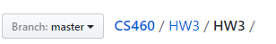
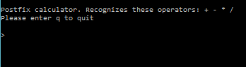
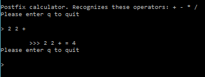
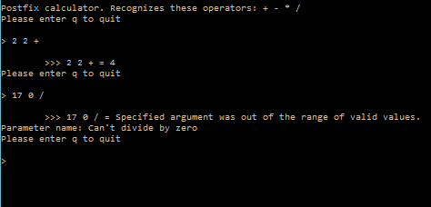
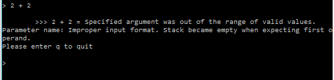

## Homework 3

For this assignment we were given a Java program and tasked with translating it into C#. The Java program is a command line Postfix calculator.

I've never used C# before, so I was a little unsure going into this. However, I found it to be a fairly straightforward and interesting language to learn.

## Links
1. [Home](https://ridethatcyclone.github.io/)
2. [Assignment Page](http://www.wou.edu/~morses/classes/cs46x/assignments/HW3.html)
3. [Code Repository](https://github.com/ridethatcyclone/CS460/tree/master/HW3/HW3)

### Diving In
For this assignment, the easiest way for me to get started was to just dive in the deep end. Starting the Visual Studio project was easy enough, although I think my file system is a little redundant:



Once I had my project set up, I just went ahead and starting typing. I used a split screen so I could have the Java program in one side and the C# program in another. I didn't copy and paste anything from one half to the other. Just typed it all out.

For the most part, this was extremely easy to do. The syntax is similar enough it was a 1:1 copy for most of the time. The one main difference I kept having to correct myself for was the naming syntax. Specifically, not using camelCase for method names.

Another large difference is the structure of the comments for documentation. C# uses XML to comment the code, so within the comments you use tags to denote different things. An example from my code is:

```cs
/// <summary>
/// Perform arithmetic.
/// </summary>
/// <param name="a">First operand</param>
/// <param name="b">Second operand</param>
/// <param name="s">operator</param>
/// <returns>The answer</returns>
public Double DoOperation(double a, double b, String s)
        {
            . . .
        }
```

Luckily these are pretty self-explanatory, but I didn't expect them at first. One thing I still need to do (as of this writeup) is go back through and convert my comments from Java style to C# style.

Finally, another major difference was the Exceptions. There is no IllegalArgumentException in C#. I had to figure out an equivalent exception to use in C#. For this, I chose ArgumentOutOfRangeException. It seems to serve the same function.

### Evaluate Post Fix Notation

The most challenging method to convert from Java to C# was the `EvaluatePostFixNotation` method. This was because C# lacks Java's `Scanner` class, so I had to come up with a way around that. In the original Java, the Scanner was used as so:

```Java
public String evaluatePostFixInput(String input)
	{
        // Code not related to the Scanner has been removed
		String s;
		Scanner st = new Scanner( input );
		while( st.hasNext() )
		{
			if( st.hasNextDouble() )
			{
				stack.push( new Double( st.nextDouble() ) );
			}
			else
			{
				. . .  // Check operator
			}
		}
		return ( (Double)( stack.pop() ) ).toString();
	}
```

So, using the Scanner, the program scans through each argument entered by the user. If it is a number, it is pushed to the stack. If it is not a number, it is checked to be sure it's a proper operator, and then the calculation is done using that operator and the operands on the stack.

However, without the scanner, I couldn't do this in that way. Instead, I used a few methods from C#. Specifically, I used `Split()` and `TryParse()` to accomplish the same task. I also changed the string variable I used from a simple String to a String array. This coincided with how the `Split()` function works, which is that it takes a string (in this case, the input) and splits it into an array using spaces as delimiters. Then, instead of checking for next() like I would in Scanner, I looped through the length of the array. In each loop, I checked if the array item was numeric using TryParse. If it was, I pushed it to the stack. If not, I checked if it was a legal operator. Aside from this difference, the code was more or less the same.

```cs
public String EvaluatePostFixInput(String input)
        {
            String[] t;
            t = (input.Split());
            for (int i = 0; i < t.Length; i++)
            {
                bool isNumeric = double.TryParse(t[i], out n);
                if (isNumeric)
                {
                    stack.Push(n);
                }
                else
                {
                    . . . // Check input
                }
            }

            return ((Double)(stack.Pop())).ToString();
        }
```

### It works!

Mostly, this was a fairly smooth process. I hit a couple of speed bumps where I mostly made dumb logic errors, but using the Visual Studios debugging tool, it was fairly easy to see where I'd gone wrong.

And it works:



When you enter a simple command in the postfix notation, it solves the problem:



When you try to divide by 0, for instance, it throws an error:



And when you enter the input incorrectly, it will let you know that too:


