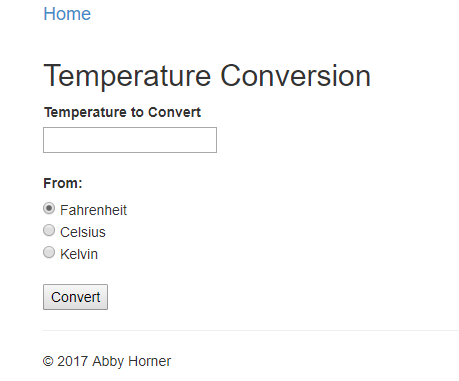
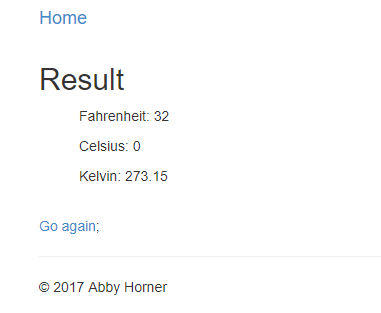
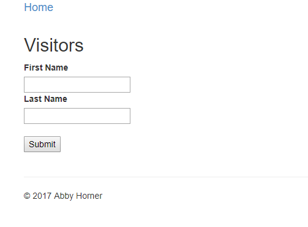
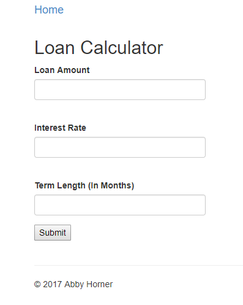

## Homework 4

This assignment was our first experience with creating an MVC web application. This particular application is not meant to use a database, and is overall intended to be a fairly simple intro into ASP.NET MVC and Visual Studio.

## Links
1. [Home](https://ridethatcyclone.github.io/)
2. [Assignment Page](http://www.wou.edu/~morses/classes/cs46x/assignments/HW4.html)
3. [Code Repository](#)

## Part One

For the first part of this assignment I decided to make what was suggested in the assignment page: a temperature converter. I knew that this first part, being my intro to MVC, would likely be the most difficult, so I didn't want to waste a bunch of time coming up with a unique idea. I was more eager to dive in and see what I could make of this. I did decide to expand slightly from the assignment page and convert from Fahrenheit, Celsius, or Kelvin into any of the other three.

For the assignment, we were expected to use an ActionResult method with no parameters and utilize query strings to parse data and create a new View after performing some calculation. I struggled most with creating a new View.

To begin with, I created my initial view and controller. My View was a very simple page, only a heading and a form:

```html
@{
    ViewBag.Title = "Temperature Conversion";
}

<h2>Temperature Conversion</h2>

<form method="get">
    <label for="num">Temperature to Convert</label><br />
    <input type="number" name="num" value="" /><br /><br />
    <label for="type">From:</label><br />
    <input type="radio" name="type" value="fahrenheit" checked /> Fahrenheit <br />
    <input type="radio" name="type" value="celsius" /> Celsius <br />
    <input type="radio" name="type" value="kelvin" /> Kelvin <br /><br />
    <input type="submit" value="Convert" />
</form>
```



Simple, but does its job. I decided to do radio buttons instead of allowing the user to input a parameter because it is easier all around to deal with. My first version of the Controller for this page looked like this:

```cs
public ActionResult Conversion()
{
    string num = Request.QueryString["num"];
    string type = Request.QueryString["type"];

    ViewBag.num = num;
    ViewBag.type = type;

    return View();
}
```

This didn't do anything in particular with the form data, so while I was working on generating a new View I also added a small line to the bottom of my View:
`<p>You want to convert @ViewBag.num degrees from @ViewBag.type</p>`

This helped me to see if the values were being parsed correctly.

In order to do the calculations, I first constructed a second View, called Result. That page looked like:

```html
@{
    ViewBag.Title = "Result";
}

<h2>Result</h2>

<ul style="list-style:none;">
    <li style="margin-top:10px;">Fahrenheit: @ViewBag.f</li>
    <li style="margin-top:10px;">Celsius: @ViewBag.c</li>
    <li style="margin-top:10px;">Kelvin: @ViewBag.k</li>
</ul>
<br />
@Html.ActionLink("Go again", "Conversion");
```
Which looks like this, when values have been entered:


Then I used those variables to construct the logic for my Controller, in which it calculates out the values:

```cs
public ActionResult Conversion()
{
    // code from above...
    if (!String.IsNullOrEmpty(num))
    {
        if (type.StartsWith('f'))
        {
            ViewBag.f = Convert.ToDouble(num);
            ViewBag.c = (ViewBag.f - 32) * 5 / 9;
            ViewBag.k = ViewBag.c + 273.15;
            return View("Result");
        }

        else if (type[0] == 'c')
        {
            ViewBag.c = Convert.ToDouble(num);
            ViewBag.f = (ViewBag.c * 9 / 5) + 32;
            ViewBag.k = ViewBag.c + 273.15;
            return View("Result");
        }

        else if (type[0] == 'k')
        {
            ViewBag.k = Convert.ToDouble(num);
            ViewBag.c = ViewBag.k - 273.15;
            ViewBag.f = (ViewBag.c * 9 / 5) + 32;
            return View("Result");
        }

        else
        {
            ViewBag.ErrorMessage("Invalid input");
            return View();
        }

    }
    return View();

}
```

I started with just checking to make sure a number was inputted. Initially I tried to check for nulls, but then I realized that since "num" is technically a string, that was a bad way to do it. So I did some googling and found C#'s `String.IsNullOrEmpty` function. It does what it says on the tin, pretty much. That solved, I moved on to the actual logic. Luckily temperature conversions are super easy, so all I really had to do was parse out which type of conversion we were working with. I did this in two ways (accidentally, mostly. I was testing them both out because I wasn't sure which would work and just realized I left them both in. Oops). The first way is by using `type.StartsWith('f')`. The second does the same thing but in an array format: `type[0] == 'k'`. I also had a default else statement, in case the user messed with the query string. With everything working as it should, I moved on to the calculations.

These were very easy, just basic math. The most difficult time I had was returning to a new view. Initially I had `return View("~/Temperatures/Result")` but that threw an error at me. I also tried a `Redirect()` but couldn't get that to work either. Finally I landed on the simpler `return View("Result")` which of course worked great.

Overall this page works wonderfully. The conversions are all correct and it does what is intended. Some stuff that would make it better, I think:
* A prettier interface, obviously
* Actual error messages when incorrect input is received
* Add it all to the same page so you don't have to go back to start a new conversion
* Limit the decimal places shown

## Part 2

For the second part of the lab I decided to create a very simple Guestbook application. Without a database its functionality is limited but it provides at the very least an interesting start to a guestbook. It currently takes input from the user and returns it on the same page to "sign" the guestbook.

This application only required two ActionController methods, a GET and a POST. The GET method very simply returned the View. The POST is where the interesting stuff happened. It took one parameter, a `FormCollection` object, checked to make sure the form was fully filled, and then assigned its values (along with the current `DateTime`) to the ViewBag to be used by the View.

```cs
public class GuestBookController : Controller
{
    [HttpGet]
    public ActionResult Visitors()
    {
        return View();
    }

    [HttpPost]
    public ActionResult Visitors(FormCollection form)
    {
        foreach (var value in form)
        {
            if (value == null)
                return new HttpStatusCodeResult(HttpStatusCode.BadRequest);
        }

        ViewBag.FirstName = form["FirstName"];
        ViewBag.LastName = form["LastName"];
        ViewBag.Time = DateTime.Now;

        return View();
    }
}
```

Then the page uses this ViewBag information to return something to the user. In this case, I used an `@if (IsPost)` to make sure that the information doesn't appear on the page if the form hasn't been submitted.

```html
<form method="post">
    <label for="FirstName">First Name</label><br />
    <input type="text" name="FirstName" value="" /><br />
    <label for="LastName">Last Name</label><br />
    <input type="text" name="LastName" value="" /><br /><br />
    <input type="submit" />
</form><br />

@if (IsPost)
{
    <p>
        Thanks for visiting @ViewBag.FirstName @ViewBag.LastName!
        Your visit was logged at @ViewBag.Time.
    </p>
}
```




## Part 3

The last part had us create a Loan Calculator. After the previous two parts this was fairly easy, even using Model binding; the most difficult part was getting the math to work with me. However, I think it is finally set up correctly.

My html was fairly straightforward. I used bootstrap to make the form look nicer than in earlier pages, however it was a very simple form. I used the "number" type to be sure that a user could not incorrectly enter characters, for instance. And I used bootstraps "form-group" and "form-control" classes to style the form. Finally, I used a Razor `@if` statement and a ViewBag element (such as was given in our example2-nodb) to be sure that the results were shown only if the form was correctly filled out. It also displayed an error if the submit button was pressed but the form was not filled out or was filled out incorrectly.

My form element:
```html
<form method="post">
    <div class="form-group">
        <label for="LoanAmount">Loan Amount</label>
        <input type="number" name="LoanAmount" class="form-control" /><br />
    </div>
    <div class="form-group">
        <label for="InterestRate">Interest Rate</label>
        <input type="number" name="InterestRate" class="form-control" /><br />
    </div>
    <div class="form-group">
        <label for="TermLength">Term Length (In Months)</label>
        <input type="number" name="TermLength" class="form-control" />
    </div>
        <input type="submit" value="Submit" />
</form>
```

And my Razor code to check for the form fields:
```html
@if (ViewBag.ShowAnswer)
{
    <h2>Results</h2>
    <div class="alert-success"><p>Initial Amount: $@ViewBag.LoanAmount<br />Interest Rate: @ViewBag.InterestRate%
         <br />Term Length: @ViewBag.TermLength months<br />Total Amount Paid: $@ViewBag.TotalAmount <br />
         Monthly Payments: $@ViewBag.Result</p></div>
}
else
{
    <div class="alert-warning">@ViewBag.ErrorMessage</div>
}
```

This is what the page looks like before any forms are filled out:


