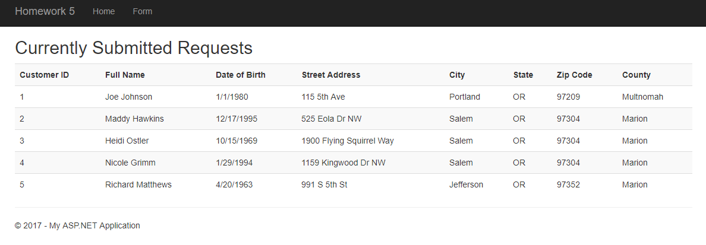
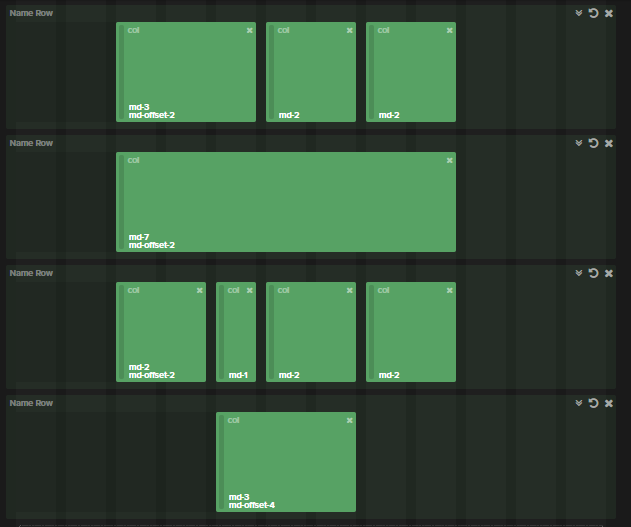
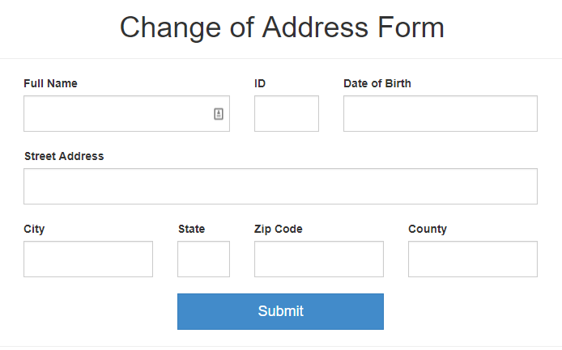
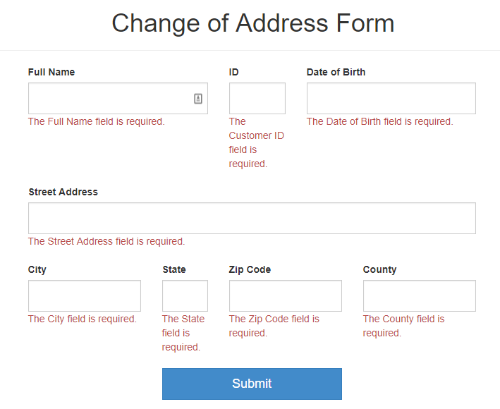
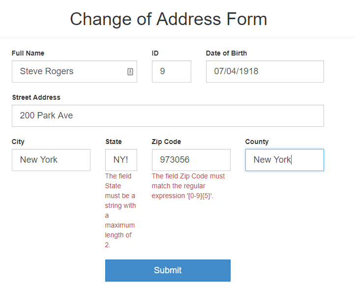
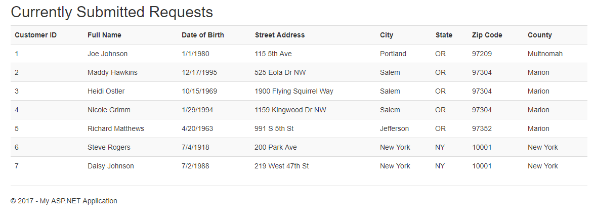

## Homework 5

For this assignment, we were tasked with recreating the DMV change of address form found [here](http://www.oregon.gov/ODOT/Forms/DMV/6438fill.pdf) in an MVC app using a simple database. I hit a lot of puzzling roadblocks in this process but with enough googling and beating my head against the wall, I came out the other end with an application I'm quite happy with.

## Links
1. [Home](https://ridethatcyclone.github.io/)
2. [Assignment Page](http://www.wou.edu/~morses/classes/cs46x/assignments/HW5.html)
3. [Code Repository](https://github.com/ridethatcyclone/CS460/tree/master/HW5)

## Getting Started

To begin with, I generated the project itself (a simple MVC Web app). I used what we had learned in class to create the database using the Server Explorer (Will add into notes page how to do so). Then I created my SQL scripts to populate/clear the database. I used two scripts as per the instructions, up.sql and down.sql. The down.sql is by far the simplest file in this project, clocking in at a measly one line:

```sql
DROP TABLE dbo.Requests;
```

All this did was delete the created table requests, so that when I run up.sql, it doesn't try to create a table that's already there. Speaking of this table to be created, I also needed a model so I would know what it would look like. My model class, to begin with, looked like this:

```cs
public class Request
{
    public int CustomerID { get; set; }
    public DateTime DateOfBirth { get; set; }
    public string FullName { get; set; }
    public string StreetAddress { get; set; }
    public string City { get; set; }
    public string State { get; set; }
    public int ZipCode { get; set; }
    public string County { get; set; }
}
```

This was just a simple overview to let me know which fields I would be needing. Then I made the up.sql script:

```sql
CREATE TABLE dbo.Requests
(
	CustomerID INT NOT NULL,
	DateOfBirth DateTime NOT NULL,
	FullName NVARCHAR(128) NOT NULL,
	StreetAddress NVARCHAR(128) NOT NULL,
	City NVARCHAR(32) NOT NULL,
	State NVARCHAR(32) NOT NULL,
	ZipCode INT NOT NULL,
	County NVARCHAR(32) NOT NULL,
	CONSTRAINT [PK_dbo.Requests] PRIMARY KEY CLUSTERED (CustomerID ASC)
);

INSERT INTO dbo.Requests (CustomerID, DateOfBirth, FullName, StreetAddress, City, State, ZipCode, County) VALUES
	(1, '1980-01-01', 'Joe Johnson', '115 5th Ave', 'Portland', 'OR', 97209, 'Multnomah'),
	(2, '1995-12-17', 'Maddy Hawkins', '525 Eola Dr NW', 'Salem', 'OR', 97304, 'Marion'),
	(3, '1969-10-15', 'Heidi Ostler', '1900 Flying Squirrel Way', 'Salem', 'OR', 97304, 'Marion'),
	(4, '1994-01-29', 'Nicole Grimm', '1159 Kingwood Dr NW', 'Salem', 'OR', 97304, 'Marion'),
	(5, '1963-04-20', 'Richard Matthews', '991 S 5th St', 'Jefferson', 'OR', 97352, 'Marion');

GO
```

This seems like a lot, but all it does is create a table with the fields defined in the Model, and then it fills 5 rows with information so we can see that the table is working. And (looking ahead slightly) when we check the table on the page:



It works!

We also need a context, of course, so in a DAL folder I created, I made a RequestContext class. It didn't contain much, but was important for the use of my database:

```cs
public class RequestContext : DbContext
{
    public RequestContext() : base("name=OurDBContext")
    { }

    public virtual DbSet<Request> Requests { get; set; }
}
```

Then I added the connection string to the Web.config file:

```html
<connectionStrings>
    <add name="OurDBContext"
   connectionString="Data Source=(LocalDB)\MSSQLLocalDB;AttachDbFilename=C:\Users\Abby\Documents\CS460_Files\CS460\HW5\HW5\App_Data\RequestsDatabase.mdf;Integrated Security=True;Connect Timeout=30;Encrypt=False;TrustServerCertificate=True;ApplicationIntent=ReadWrite;MultiSubnetFailover=False"
   providerName="System.Data.SqlClient" />
</connectionStrings>
```

With that, I was ready to start on my Views and Controllers to display and receive data. I only used two Views for this application, Index and Create. Index I used as a landing page and to display all the data received, and then Create was used as a form for the user to input data to be added to the database. These I added in their own folder (though I probably should have just repurposed the Home folder) and redirected the Home/Index page to the Requests/Index page (Using `return Redirect("~/Requests/Index");`)

My index page was the easiest to generate, as all it really is is a table with a `@foreach` code block to add each row in the database table to the view's table. First I made all the table headers (with code based off of the Example 2 code), then I used the `@foreach` to add each row:

```html
<table class="table table-striped">
    <tr>
        <th>@Html.DisplayNameFor(model => model.CustomerID)</th>
        <th>@Html.DisplayNameFor(model => model.FullName)</th>
        <!-- etc -->
    </tr>

@foreach (var item in Model)
{
    <tr>
        <th>@Html.DisplayFor(modelItem => item.CustomerID)</th>
        <th>@Html.DisplayFor(modelItem => item.FullName)</th>
        <!-- etc -->
    </tr>
}
</table>
```

One step I forgot while I was working on this and then couldn't figure out why my table wasn't generating, was to add the model to the page. At the very top, I inserted the line `@model IEnumerable<HW5.Models.Request>` and finally my model connected and my table populated!

One thing I didn't like about the table, however, was that the birthday would show the time as well (Which, since I didn't enter a time, defaulted to 00:00:00). I decided to set some parameters and restrictions from within the model class to fix this.

First, I set everything to `[Required]` to make sure the user didn't skip any inputs. Then I changed a few display names (such as FullName to Full Name) so that the table looked nicer. I changed the display format of the datetime variable, and I also placed some restrictions on the State and ZipCode inputs, to be sure I was getting accurate and useful information.

When all was said and done, my model class looked like this:

```cs
public class Request
{
    [Required]
    [Display(Name = "Customer ID")]
    [Key]
    [DatabaseGenerated(DatabaseGeneratedOption.None)]
    public int CustomerID { get; set; }

    [Required]
    [Display(Name = "Date of Birth")]
    [DisplayFormat(DataFormatString = "{0:d}", ApplyFormatInEditMode = true)]
    public DateTime DateOfBirth { get; set; }

    [Required]
    [Display(Name = "Full Name")]
    public string FullName { get; set; }

    [Required]
    [Display(Name = "Street Address")]
    public string StreetAddress { get; set; }

    [Required]
    public string City { get; set; }

    [Required]
    [StringLength(2)]
    public string State { get; set; }

    [Required]
    [Display(Name = "Zip Code")]
    [RegularExpression("[0-9]{5}")]
    public int ZipCode { get; set; }

    [Required]
    public string County { get; set; }
}
```

The reasoning for the code above my CustomerID is that I continually ran into an issue submitting my form (later on, obviously) in which the program would error out due to CustomerID being null (which is wasn't). It's a little weird in the details, but essentially it wanted me to input a generated number in a different way than I was aiming for. The code above was found on StackOverflow on a question in which the questioner had the exact same issue I did.

Now, finally, it was time to move on to my form. I started off by pre-generating a Create view so that I could see how MVC did it, then built my own based on what I learned. I decided I wanted to make my form a little unique looking and centered, more like an actual form someone would fill out on paper. Using [this](http://www.layoutit.com/) tool I made a rough wireframe for how the bootstrap groups needed to look then got to work.

First I started with a container class, then 4 rows. The first row contained 3 input fields, the second row contained 1, the third had 4, and the last had only the submit button. All of this was enclosed in a Razor `Html.BeginForm()` tag.

The basic page, without any content besides which field will go where:

```html
<div class="container">
    @using (Html.BeginForm())
    {
        <div class="row">
            <div class="col-md-3 col-md-offset-2">Full Name</div>
            <div class="col-md-2">Customer ID</div>
            <div class="col-md-2">Date of Birth</div>
        </div>

        <div class="row">
            <div class="col-md-7 col-md-offset-2">Street Address</div>
        </div>

        <div class="row">
            <div class="col-md-2 col-md-offset-2">City</div>
            <div class="col-md-1">State</div>
            <div class="col-md-2">Zip Code</div>
            <div class="col-md-2">County</div>
        </div>

        <div class="row">
            <div class="col-md-3 col-md-offset-4">Submit</div>
        </div>
    }
</div>
```

Using [this site](http://shoelace.io/) for a wireframe, this is what that would translate to:



For the actual form elements, I firstly decided to use bootstraps `input-group` and `input-group-lg` classes, because I like the way they look. However, they also overwrite the max width of the elements, so for some of them I had to toss a style into the HTML tag as well. Then I mostly used Razor elements to fill in the labels and the fields as well as the validation messages.

For instance, this was my code for the first three fields, which took the most styling (as originally, the ID field wasn't wide enough to show the whole ID, then when I switched it to 2 columns instead of 1, it was too wide and annoyed me. So finally, I messed with the margins.)

```html
<div class="col-md-3 col-md-offset-2">
    <div class="input-group input-group-lg" style="width:100%;">
        @Html.LabelFor(model => model.FullName, htmlAttributes: new { @class = "control-label"} )
        @Html.EditorFor(model => model.FullName, new { htmlAttributes = new { @class = "form-control input-lg"}})
        @Html.ValidationMessageFor(model => model.FullName, "", new { @class = "text-danger"})
    </div>
</div>
<div class="col-md-2">
    <div class="input-group input-group-lg" style="width:50%;">
        <label for="CustomerID" class="control-label">ID</label>
        @Html.EditorFor(model => model.CustomerID, new { htmlAttributes = new { @class = "form-control input-lg" } })
        @Html.ValidationMessageFor(model => model.CustomerID, "", new { @class = "text-danger" })
    </div>
</div>
<div class="col-md-2">
    <div class="input-group input-group-lg" style="width:150%; margin-left:-50%;">
        @Html.LabelFor(model => model.DateOfBirth, htmlAttributes: new { @class = "control-label" })
        @Html.EditorFor(model => model.DateOfBirth, new { htmlAttributes = new { @class = "form-control input-lg" } })
        @Html.ValidationMessageFor(model => model.DateOfBirth, "", new { @class = "text-danger" })
    </div>
</div>
```

There was also a `@Html.ValidationSummary(true, "", new { @class = "text-danger" })` at the beginning of the form, to set up the validation messages.

And my submit button at the bottom was styled like this:

```html
<div class="row">
    <div class="col-md-offset-4 col-md-3">
        <div class="input-group input-group-lg" style="width:100%;">
            <input type="submit" value="Submit" class="btn btn-lg btn-primary" style="border-radius:0px; width:100%;" />
        </div>
    </div>
</div>
```

And finally, I added a header and centered it a little weirdly above my not-actually-quite-centered form:

```html
<div class="page-header" style="text-align:center; width:92%">
    <h1>Change of Address Form</h1>
</div>
```
Overall, the form page ended up looking like this:



It also made sure all fields were filled:



And it even correctly checks that the strings are the right length:




Once my form was looking good, I had to get the Controller working, so that everything could be tied together. This luckily was fairly simple, as I didn't implement anything for the form other than a create function.

The Index function was fairly simple. First, for the Controller, I had to instantiate a RequestContext object to be used. Then I simply returned a View using that object to call the table and output it to a list.

The Create GET view was even easier, as all it does it return the View of the form.

For the POST method, I simply followed the code in the example to generate a new Request object to then add to the database. If it succeeded in this, it redirected the user to the Index page, where they could see the new request added to the table.

The controller code is as follows:

```cs
public class RequestsController : Controller
{
    private RequestContext db = new RequestContext();

    public ActionResult Index()
    {
        return View(db.Requests.ToList());
    }

    public ActionResult Create()
    {
        return View();
    }

    [HttpPost]
    public ActionResult Create([Bind(Include = "FullName, DateOfBirth, CustomerID, StreetAddress, City, State, ZipCode, County")] Request request)
    {
        if (ModelState.IsValid)
        {
            db.Requests.Add(request);
            db.SaveChanges();
            return RedirectToAction("Index");
        }

        return View(request);
    }
}
```

And that was it! Everything was ready to go and working. I added a couple of entries to the table to be sure it worked fine:



A lot of the nitpicky problems I ran into over the course of this assignment had more to do with me forgetting a line in a file than anything else.

Ways I could improve this application in the future:
* Add edit and delete options
* Generate the Customer ID (Decided not to pursue this as the assignment suggested it should be an entry field)
* Fix up the validation messages so they are more
* Work on bootstrap layout so form looks nice no matter the screen size, as right now... They struggle.

Overall, I am very happy with how this application turned out!
