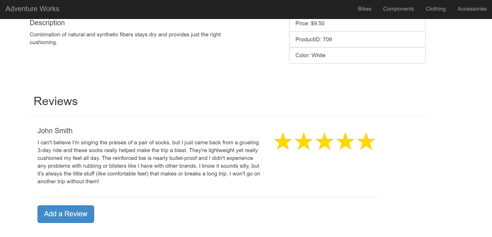

## Homework 6

For this assignment we were instructed to create an application, using the Adventure Works 2014 database, that mimicked a shopping site, essentially. It needed to have a two-layer navigation where the user could select a category and subcategory of products. It would then display to the user the products under those selected categories. The user could pick a product and see more details, as well as reviews. The user could also submit a review.

There were a lot of parts to this project, and some parts where definitely more difficult than others, but altogether I think this project came together well.

## Links
1. [Home](https://ridethatcyclone.github.io/)
2. [Assignment Page](http://www.wou.edu/~morses/classes/cs46x/assignments/HW6.html)
3. [Code Repository](https://github.com/ridethatcyclone/CS460/tree/master/HW6)
4. [Video of Working App](https://youtu.be/CdCtjV6uvgQ)

## The Assignment

To start this assignment, I first had to restore the database from the backup file and connect it to my project. Luckily, with SQL Server Managagement Studio, this was fairly easy. I first had to connect to my local database (server name: (localDB)\MSSQLLocalDB), then all I had to do was restore the database from the .bak file. Once the database was loaded into my LocalDB, I was ready to set up the project.

Again, it was much easier this time around, using an existing database. I only imported the Product tables, so that I didn't have way too many Models. I still ended up with more models than I used, but not as many as I could have:


Once my models were all generated, I started working on my views. I first edited the shared layout, to give my website a uniform appearance. It was a very simple shared layout; the bulk of it was just loading stylesheets and scripts. However, I also created a jumbotron and a navbar:

```html
<body>
  <div class="jumbotron clearfix" style="background-image: url('/images/bikes.jpg'); background-position: center top; background-size: cover; background-repeat: no-repeat; min-height: 300px; margin-top: 0px; padding-top: 0px;">
  </div>
  @{Html.RenderAction("GetNavbar", "Home");}
  <div class="container body-content">
    @RenderBody()
  </div>
</body>
```

Unfortunately I ended up putting a lot of CSS into the HTML tag for my jumbotron. I could have moved it to the stylesheet file, but I... didn't. Heh.

This code does reference some stuff I haven't gotten to yet, specifically the navbar code. But that's what I did next! So, the navbar view. This one took some serious logic-ing for me. In fact, I'd comfortably say figuring out how to populate the navbar was the most difficult part of this assignment. I initially tried using a ViewModel to create it, however I puzzled over that for a long time before giving up and resorting to the ViewBag and ViewData.

```html
<nav class="navbar navbar-fixed-top navbar-inverse">
  <div class="container-fluid">
    <div class="navbar-header">
      @Html.ActionLink("Adventure Works", "Index", "Home", new { @class = "navbar-brand" })
    </div>

    <ul class="nav navbar-nav navbar-right">
      @for (int i = 0; i < ViewBag.Categories.Length; i++)
      {
        <li class="dropdown">
          <a href="#" class="dropdown-toggle" data-toggle="dropdown">@ViewBag.Categories[i]</a>
          <ul class="dropdown-menu">
            @foreach (var item in ViewData[ViewBag.Categories[i]] as IList<string>)
              {
                <li>
                  @Html.ActionLink(
                          item,
                          "Display",
                          "Home",
                          new { @PID = item },
                          null
                  )
                </li>
              }
          </ul>
        </li>
      }
    </ul>
  </div>
</nav>
```

There's a lot to unpack there. Basically, I just nested a couple of loops. First I loop over the categories (which I receive from the controller, which we'll get to) and within that loop for each category I loop over the subcategories. I used a bootstrap dropdown menu to make this work.

So for the controller for my navbar, it's... A *lot* of ugly code. Firstly I used the `[ChildActionOnly]` parameter to define it, and as a `PartialViewResult`. This was so other Views could render it within themselves, without overwriting them.

The code, ugly though it may be:

```cs
[ChildActionOnly]
        public PartialViewResult GetNavbar()
        {
            using (ProductsContext db = new ProductsContext())
            {
                //Create the categories array
                var Cat = new string[db.ProductCategories.Count()];

                //Loop through and generate the category and its subcategories. Subcategories are added as a list to ViewData.
                for (int i = 1; i <= db.ProductCategories.Count(); i++)
                {
                    var x = db.ProductCategories.Where(p => p.ProductCategoryID == i).Select(p => p.Name).FirstOrDefault().ToString();
                    if (x != null)
                    {
                        Cat[i - 1] = x;
                        IList<string> a = new List<string>();
                        foreach (var item in db.ProductSubcategories)
                        {
                            if (item.ProductCategoryID.Equals(i))
                                a.Add(item.Name);
                        }
                        ViewData[x] = a;

                    }
                }
                ViewBag.Categories = Cat;
                return PartialView("_Navbar");
            }

        }
```

Finally, I just made a simple landing page. I used Lorem Ipsum, because I'm not creative enough to come up with more than like, two opening sentences:

```html
<div class="container">
  <h1 style="margin-top:-5px;">Welcome</h1>
  <div class="row">
    <div class="col-md-6">
      <p style="text-align:justify;">Text</p>
    </div>
    <div class="col-md-6">
      <p style="text-align:justify;">Text</p>
    </div>
  </div>
</div>
```

With everything all set up for the basic display, this was my page:


Next up was the page a user is shown once they select a category and a subcategory. All I really needed it to do was list the products that fit the bill, but I decided to add the product ID, the color of the item, and its price. I used a simple table for this, with similar logic to the navbar where I simply looped through each item and generated a table row for every item. For this to work, I had to add `@model IEnumerable<HW6.Product>` to the top of the file, so I could access the products table.

```html
<h3>@ViewBag.DisplayCat : @ViewBag.DisplaySub</h3>
<hr />

<table class="table table-striped">
  <tr>
    <th>@Html.DisplayNameFor(model => model.Name)</th>
    <th>@Html.DisplayNameFor(model => model.ProductID)</th>
    <th>@Html.DisplayNameFor(model => model.Color)</th>
    <th>@Html.DisplayNameFor(model => model.ListPrice)</th>
  </tr>

  @foreach (var item in Model)
  {
    if (item.ProductSubcategoryID == ViewBag.SubID)
    {
      <tr>
        <td>
          @Html.ActionLink(
                @Html.DisplayFor(model => item.Name).ToString(),
                "Item",
                "Home",
                new { @product = item.ProductID },
                null
          )
        </td>
        <td>@Html.DisplayFor(modelItem => item.ProductID)</td>
        <td>@Html.DisplayFor(modelItem => item.Color)</td>
        <td>@Html.DisplayFor(modelItem => item.ListPrice)</td>
      </tr>
    }
  }
</table>
```

Then the controller for the Display, which is longer and uglier than the navbar, unfortunately. Essentially what it does is take the query string (which contained the subcategory), checked to make sure it was actually there (so that when I inevitably launched the project from the wrong page, it didn't error out because of not having a subcategory to load)

Then I instantiated the database, pulled product IDs and categories, and used those to return to the page.

```cs
public ActionResult Display()
        {
            //Get subcategory name from query string
            string DisplaySubcategory = Request.QueryString["PID"];

            //Check validity
            if (string.IsNullOrEmpty(DisplaySubcategory))
            {
                return RedirectToAction("Index");
            }

            using (ProductsContext db = new ProductsContext())
            {
                //Getting the Category and Subcategory ID Numbers (as well as the names, for the heading)
                int id = db.ProductSubcategories.Where(p => p.Name.Equals(DisplaySubcategory)).Select(p => p.ProductCategoryID).FirstOrDefault();
                string DisplayCategory = db.ProductCategories.Where(p => p.ProductCategoryID == id).Select(p => p.Name).FirstOrDefault().ToString();
                int SubcategoryID = db.ProductSubcategories.Where(p => p.Name.Equals(DisplaySubcategory)).Select(p => p.ProductSubcategoryID).FirstOrDefault();

                //Names
                ViewBag.DisplaySub = DisplaySubcategory;
                ViewBag.DisplayCat = DisplayCategory;

                //Numbers
                ViewBag.SubID = SubcategoryID;
                ViewBag.PrimID = id;

                return View(db.Products.ToList());
            }
        }
```

With that all set, the display page looks like this, when I select the category Bikes and the subcategory Road Bikes:


So the next logical thing was to work on the item page, which is what would display when the user selects any item. A *lot* had to go into this particular page, if just because of the fact that many products had optional parts to them. For instance, not all products contain information on the color. On the previous page, it would just leave the table entry blank then. On this one, it would error out, due to the way I assigned the variables.

The basic frame of my Item page looks like this:

```html
<div class="container">
  <div class="row">

    <div class="col-md-6">
      <h4>Description</h4>
      <p>Product description here.</p>
    </div>

    <div class="col-md-4 col-md-offset-1">
      <ul class="list-group">
        <li class="list-group-item">Price</li>
        <li class="list-group-item">Product ID</li>
        <li class="list-group-item">Color</li>
      </ul>
    </div>

  </div><br /><br />
  <div class="row match-col">

    <div class="col-md-11">
      <div>
        <h2>Reviews</h2>
      </div>
      <hr />
      <div class="reviews">
        Reviews here
      </div>
    </div>

  </div>

</div>
```

Then I had to get more complex within that wireframe. Firstly, with the optional parts. To check for these, I simply wrapped each section in an `if` loop to check if the parameter was null, as so:

```html
@if (ViewBag.ItemDescription != null)
{
  @ViewBag.ItemDescription
}
else
{
  <text>Oops! No description for this item just yet. Check back soon!</text>
}
```

The real complexity came in with the reviews, however. Not really because of displaying the reviews, but because I decided I wanted to show the ratings in a visual way, with rating stars. This I ended up sourcing from code I found [here](https://codepen.io/mcallaro88/pen/EWQdRX).

The review div:

```html
<div class="reviews">
  @if (ViewBag.HasReviews)
  {
    foreach (var item in Model)
    {
      if (item.ProductID == ViewBag.ItemID)
      {
        <div class="row">
          <div class="col-md-8">
            <div class="review">
              <h4>@item.ReviewerName</h4>
              <p>@item.Comments</p>
            </div>
          </div>

          <div class="col-md-4">
            <div class="rating">
              <div class="rating-full" style="width:@((item.Rating)*20)%">
                <span>★★★★★</span>
              </div>
              <div class="rating-empty">
                <span>★★★★★</span>
              </div>
            </div>
          </div>

        </div>
        <hr />
      }
    }
  }
  else
  {
    <p>No reviews for this product yet! Would you like to create one?</p>
  }
  <a href="@Url.Action('Create', 'Home', new { @product = ViewBag.ItemID })"><button type="button" class="btn btn-primary btn-lg">Add a Review</button>
</div>
```

And the CSS for the stars:

```css
.rating {
  unicode-bidi: bidi-override;
  color: #ccc;
  font-size: 64px;
  position: relative;
  margin: 0;
  padding: 0;
}

.rating .rating-full {
  color: #ffd800;
  padding: 0;
  position: absolute;
  z-index: 1;
  display: block;
  top: 0;
  left: 0;
  overflow: hidden;
}

.rating span {
  display: inline-block;
}

.rating-empty {
  padding: 0;
  display: block;
  z-index: 0;
}
```

The setup for the stars is essentially similar to what I did for my progress bar in an earlier homework. It's two identical divs layed over the top of each other, and one of them is only partially visible (so to speak, it's actually the width that I'm messing with) so that it looks like some stars aren't full.

Finally, the real bulk of this page is in the Controller. This is the longest and ugliest of my controllers, so buckle in.

To start with, a wireframe of the ActionResult. It's just barebones with my comments and no code, and I'll break down each section separately, to keep it small(ish):

```cs
public ActionResult Item()
{
  //Get id from query string

  //Make sure the user actually inputs a request

  //Start of db logic

  //Getting item Product ID

  //Getting item name

  //Getting item description

  //Getting item price

  //Getting item color

  //Check if item has reviews

  //Return view
}
```

The first part, getting the id from the query string, is the easiest part and is the same as the other parts that do the same. I then check it to make sure it's valid, because of my aforementioned habit of launching the project from the wrong page.

```cs
//Get id from query string
string id = Request.QueryString["product"];

//Make sure the user actually inputs a request
if (string.IsNullOrEmpty(id))
{
  return RedirectToAction("Index");
}
```

Then I instantiate the database and get started. First I retrieved the product ID and used that to get the item name, then I put those values into the ViewBag.

```cs
//Start of db logic
using (ProductsContext db = new ProductsContext())
{
  //Getting item Product ID
  int pid = int.Parse(id);
  ViewBag.ItemID = pid;

  //Getting item name
  string itemName = db.Products.Where(p => p.ProductID == pid).Select(p => p.Name).FirstOrDefault().ToString();
  ViewBag.ItemName = itemName;
}
```

Next I got the item description. This was not something a product necessarily had, so I encased it in a try/catch. I had to move around the tables a little bit, so it took some logic. First I got the product model ID, using the product ID. From that, I got the product description ID. From that, I got the description and added it to the viewbag. If that failed, then the item description was simply set to null.

```cs
//Getting item description
try {
  int pmid = (int)db.Products.Where(p => p.ProductID == pid).Select(p => p.ProductModelID).FirstOrDefault();
  int descid = (int)db.ProductModelProductDescriptionCultures.Where(p => p.ProductModelID == pmid).Select(p => p.ProductDescriptionID).First();
  string desc = db.ProductDescriptions.Where(p => p.ProductDescriptionID == descid).Select(p => p.Description).FirstOrDefault().ToString();
  ViewBag.ItemDescription = desc;
} catch
{
  ViewBag.ItemDescription = null;
}
```

For the item price and item color, we're mostly back to simplicity. For color I used a try/catch again to make sure I don't error out, but it's not as complex of logic to find the info.

```cs
//Getting item price
decimal price = db.Products.Where(p => p.ProductID == pid).Select(p => p.Product.ListPrice).FirstOrDefault();
ViewBag.ItemPrice = price;

//Getting item color
try {
  string color = db.Products.Where(p => p.ProductID == pid).Select(p => p.Color).FirstOrDefault().ToString();
  ViewBag.ItemColor = color;
} catch {
  ViewBag.ItemColor = null;
}
```

Finally, all I had to do was check if the item had reviews or not and return the view with the ProductReviews. To check for reviews, I simply looped through the ProductReviews table and checked if the productID on each review matched the current product. If it did, I set the bool to true and broke from the loop.

```cs
//Check if item has reviews
ViewBag.HasReviews = false;
foreach (var item in db.ProductReviews)
{
  if (item.ProductID == pid)
  {
    ViewBag.HasReviews = true;
    break;
  }
}

//Return view
return View(db.ProductReviews.ToList());
```

Gosh, that was a lot. So finally, that ActionResult is complete. Now our page should work beautifully, and it does:




Now, the only thing left to do was to make sure a user could add reviews! This was probably the easiest part, as it was very straightforward.

First, I created the view. It's just a simple form, although I did struggle with the textbox somewhat. Mostly just finicky CSS things.

```html
@using (Html.BeginForm())
{
  <div class="row">
    <div class="col-md-4 col-md-offset-2">
      <div class="form-group">
        @Html.LabelFor(model => model.ReviewerName, htmlAttributes: new { @class = "control-label" })
        @Html.EditorFor(model => model.ReviewerName, new { htmlAttributes = new { @class = "form-control input-lg" } })<br />
        @Html.LabelFor(model => model.EmailAddress, htmlAttributes: new { @class = "control-label" })
        @Html.EditorFor(model => model.EmailAddress, new { htmlAttributes = new { @class = "form-control input-lg" } })
        <br />
        @Html.LabelFor(model => model.Rating, htmlAttributes: new { @class = "control-label" })
      </div>
      <br /><br />
      <div class="row">
        @for (int i = 0; i < 5; i++)
        {
          <div class="col-md-1">
            @Html.RadioButtonFor(model => model.Rating, i, new { htmlAttributes = new { @class = "form-control input-lg", @style = "padding:5px;", @value = i } })<br />
            @i
          </div>
        }
      </div>
    </div>

    <div class="col-md-6">
      <div class="form-group">
        @Html.LabelFor(model => model.Comments, htmlAttributes: new { @class = "control-label" })
        @Html.TextAreaFor(model => model.Comments, new { @class = "form-control", @rows = "10" })
      </div>
    </div>

  </div>

  <div class="row">
    <br />
    <div class="col-md-5"></div>
    <div class="col-md-1"><input type="submit" class="btn btn-primary btn-lg" value="Submit" /></div>
    <div class="col-md-5"></div>
  </div>
}
```

Then I just had to make the two Action controller methods, the GET and POST. They're both pretty straightforward as well. The GET method just checks the query string and returns the view depending on whether or not it's valid. The post is of course more complicated, but it's less complicated than the Item controller, so...

```cs
public ActionResult Create()
{
  string id = Request.QueryString["product"];
  if (string.IsNullOrEmpty(id))
  {
    return RedirectToAction("Index");
  }
  return View();
}

public ActionResult Create([Bind(Include="ReviewerName, EmailAddress, Rating, Comments")] ProductReview review)
{
  string spid = Request.QueryString["product"];
  int pid = int.Parse(spid);
  using (ProductsContext db = new ProductsContext())
  {
    DateTime now = DateTime.Now;
    review.ReviewDate = now;
    review.ModifiedDate = now;
    review.ProductID = pid;
    review.Product = db.Products.Where(p => p.ProductID == pid).FirstOrDefault();

    if (ModelState.IsValid)
    {
      db.ProductReviews.Add(review);
      db.SaveChanges();
      return RedirectToAction("Item", new { product = review.ProductID });
    }

    return View(review);
  }
}
```

And that's all it was! The page looks like this:


It's still a little finicky, but it works! And phew, that was a lot of unfortunate-looking code.
