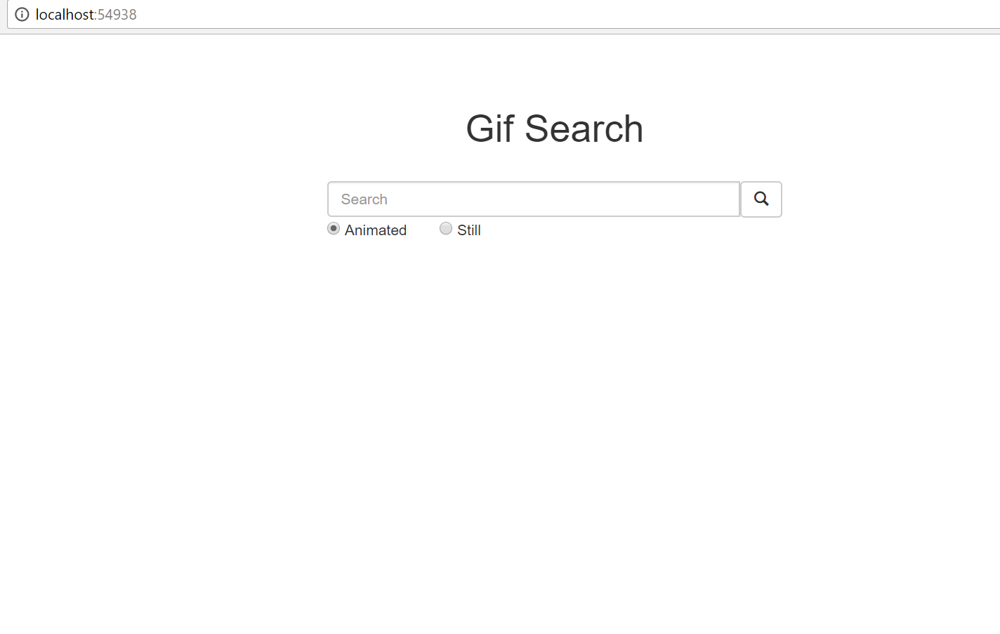
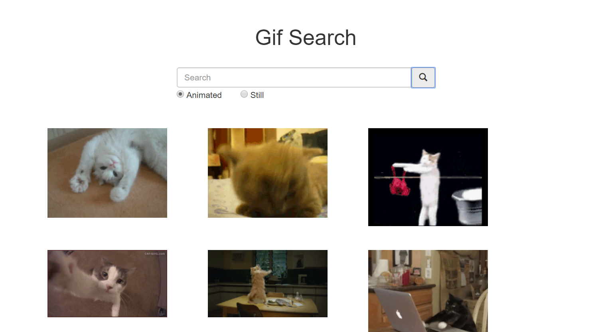

## Homework 7

For this homework we were tasked with creating a single-page website that uses the Giphy API and AJAX to return search results in the form of gifs.

## Links
1. [Home](https://ridethatcyclone.github.io/)
2. [Assignment Page](http://www.wou.edu/~morses/classes/cs46x/assignments/HW7.html)
3. [Code Repository](https://github.com/ridethatcyclone/CS460/tree/master/HW7)
4. [Video of Site](https://www.youtube.com/watch?v=hSQMhSZKbCY&feature=youtu.be)

### Getting Started

This assignment was difficult for me because AJAX is very complicated and I had a hard time picking it up. Also, I really wanted to put a lot of effort into styling the results of my search but had to focus on getting the actual search to work instead.

To get started I just began with a simple HTML layout with a form for the search. Initially, I had only a text box and a button. A small amount more would be added later. This is the HTML for my site, with the radio buttons I added later included:

```Html
@{
    ViewBag.Title = "Home";
}

<div class="container">
    <div class="row">
        <div class="col-md-offset-3 col-md-6" style="text-align:center;">
            <h1>Gif Search</h1>
        </div>
    </div><br />
    <!--Beginning of searchbar row-->
    <div class="row">
        <div class="col-md-offset-3 col-md-6">
            <div style="margin:0 auto;">
                <form class="form-inline" id="search">
                    <div class="form-group">
                        <div class="input-group" style="width:80%; margin: 0 auto;">
                            <input class="form-control" id="sbar" placeholder="Search" type="text">
                            <span class="input-group-btn">
                                <button class="btn btn-default" type="button" id="submitButton"><span class="glyphicon glyphicon-search"></span></button>
                            </span><br />
                        </div>
                        <div class="input-group" style="width:80%; margin: 0 auto;">
                            <input type="radio" name="animated" value="true" /> Animated
                            &nbsp;&nbsp;&nbsp;&nbsp;&nbsp;&nbsp;
                            <input type="radio" name="animated" value="false" /> Still
                        </div>  
                    </div>
                </form>
            </div>
        </div>
    </div>
    <br />
    <div class="row" id="gifList">
        <div class="rowList">
            <div class="row gifRow" id="topRow"></div>
            <div class="row gifRow" id="middleRow"></div>
            <div class="row gifRow" id="bottomRow"></div>
        </div>
    </div>

</div>
```

I used an excessive amount of divs basically with the goal of getting the entire site centered. Which it is, so that's a win for me! Then I just had a title, the form, and a div for my gifs to be displayed.

My CSS for this one was:

```CSS
#searchbar {
    width:80%;
}

#searchcontrols {
    align-content:center;
}

#gifList {
    width:85%;
    margin: 0 auto;
}

#gifList .gifRow {
    padding:15px;
    margin:10px;
}

#gifList .gifCol {
    width:30%;
    overflow:hidden;
}

.displayGif {
    width:200px;
    height:auto;
    margin: 0 auto;
}

#gifList .rowList {
    margin: 0 auto;
}
```

Again, almost all of this was just to center the page and make it look slightly nicer. It still is a pretty ugly webpage, but not as ugly as it was. Which is... something?


### Using Giphy's API

One thing I ran into was hiding my Giphy API key. The solution I came up with is fairly simple but it definitely works. I have a .config file outside of my repository with the following code in it:

```html
<appSettings>
	<add key="GiphyAPIKey" value="#" />
</appSettings>
```

Where, obviously, the value is my API key. Then in my Web.config in my project, I simply reference that file by path with `<appSettings file="C:\. . ."></appSettings>`. And that works! Then to use my API key, in my controller I passed it as a variable. My Controller itself is extremely simple, just a few lines of code:

```cs
public class HomeController : Controller
    {
        public ActionResult Index()
        {
            string GiphyAPIKey = System.Web.Configuration.WebConfigurationManager.AppSettings["GiphyAPIKey"];
            ViewBag.GiphyKey = GiphyAPIKey;
            return View();
        }

    }
```

So then I have my key in the ViewBag for use in the View (or the javascript..). Next came the scripting of this search. This is where the bulk of the assignment lives, and is also what gave me the most problems. I decided to go ultra simple just to make things easier on myself and have not implemented pagination of any sort. The search only shows the first nine gifs returned, no matter what.

```javascript
var searchString = '';
var requestLink = '';
var key = $("#key").data(value);

function main() {
  $('#submitButton').on('click', function() {
    // LOGIC FOR SEARCH HERE
  });
}

$(document).ready(main);
```

That is the basic layout of my javascript. The logic in the anonymous function on the button click is the most complicated bit, but even that is actually pretty straightforward once you get down to the barebones. An important aside on this one: to get my API key value from the controller to my javascript, I had to pass it through the view. The best way I could think of to do this was pass it as a hidden value in an invisible form object. This I actually put in my shared layout page. It simply looks like this:

```Html
<input type="hidden" id="key" data-value="@ViewBag.GiphyKey" />
```

That way the javascript has something from the DOM it can parse for my key, and I'm not just placing the raw data of the key itself somewhere it can be taken.

Moving on, the logic for my javascript:

```javascript
$('#submitButton').on('click', function() {
  // Check if there's anything in the search bar
  if (!($('#sbar').val())) {
    console.log("Nothing entered.");
  }
  else {
    // Bulk of the logic goes here. A search term was successfully found...

    // This checks which radio button is checked, for if the search results should be animated or not.
    var animated = $("input[name='animated']:checked").val();

    // Replaces all the spaces in the search query with +
    searchString = $("#sbar").val().replace(" ", "+");
    $("#sbar").val();

    // Builds the link
    requestLink = "http://api.giphy.com/v1/gifs/search?q=" + searchString + "&api+key=" + key;

    // Empties out the div for the gifs
    $(".gifRow").html(null);

    // AJAX
    $.ajax({
      type: 'GET',
      url: requestLink,
      dataType: 'json',
      success: function(response) {
        console.log('success', response) // Just for my own purposes, can be removed

        // Checking if it should be animated. Note that the input is not actually a bool, so I'm comparing as strings
        if (animated == 'true') {
          for (i = 0; i < 9; i++) {
            if (i < 3) {
              $('#topRow').append('<div class="col-md-4 gifCol"></div>');
            }
            else if (i >= 3 && i < 6) {
              $('#middleRow').append(. . .);
            }
            else {
              $('#bottomRow').append(. . .);
            }
          }
        }
        else {
          // Same logic but with fixed_width_still.url instead.
        }
      }
    });
  }
})
```

And that's it! I create a searchString and a requestLink variables to hold those two things and initialize them to empty strings. Then the key I pull from my shared layout html file. In main, I made an onclick function for my submit button. Note that it's not actually a submit button, as I didn't want the page to refresh. Because of that, and because it's an onclick function, the search *will not* work if the user enters a search string and hits enter on their keyboard. I could have added an event listener for that as well but as it was I was really just focused on getting basic functionality down.

Within the onclick function, I first check to make sure the search bar isn't empty. If the user didn't enter anything, I don't want to perform a search after all!

Then, once I've confirmed that the user did enter something, I need to pull a couple of variables. First, I check which radio button the user has checked. I put the value from that into a variable, `animated`, so that I may use it later. Note that though I gave the radio buttons the values of true and false, they are actually string values, so I can't compare them as bools.

Next I added the value from the search bar (that is, what the user wants to search) into my searchString variable, replacing all of the spaces with + so that it will work in the URL search. Finally, I create the requestLink using my giphy API link, the searchString, and my key value.

With all my values set, I clear out the div that the gifs will be held in and start my ajax function.

The ajax is fairly straightforward, once you have it figured out. I give it the requestLink I've just built, and on a successful return I run through some simple logic to append the gifs onto the HTML gifRows.

And just like that, my page is good to go!

Here's what it looks like without the search being performed:



And here it is with a search (for 'cat', the most popular type of gifs) performed:



Then the only thing left to do (that, honestly, I forgot about until *way* later than I should have) was to add the database to log all the searches performed. This was super simple to do. The database is only one table, with a SearchID, a SearchPhrase, and a Timestamp. I didn't include the Animated vs Still thing because... I didn't think about it. To be fair to myself, I added this database in like record time, soooo...

The up (and down, all in one) script for SQL:

```SQL
DROP TABLE IF EXISTS dbo.Searches

CREATE TABLE dbo.Searches (
  SearchID INT IDENTITY(1,1) NOT NULL,
  SearchPhrase NVARCHAR(128) NOT NULL,
  Timestamp DATETIME NOT NULL,

  CONSTRAINT[PK_dbo.Searches] PRIMARY KEY CLUSTERED (SearchID ASC)
);
```

And then I made a function in my controller to handle the logic of adding to the database, and a second ActionResult function for my Index page, this one to POST.

```cs
[HttpPost]
public ActionResult Index(string search)
{
    AddLog(search);
    return View();
}

public void AddLog(string search)
{
    var log = new Search();
    log.SearchPhrase = search;
    log.Timestamp = DateTime.Now;

    if (ModelState.IsValid)
    {
        db.Searches.Add(log);
        db.SaveChanges();
    }
}
```

Probably could have done the AddLog function simply within the Index() logic, but it seemed neater this way. After that was ready, all that was left was to do the logic in ajax. Initially I thought there might be a way for me to call this in the same ajax method I used to get the data for the webpage, but once I started working on it that seemed unnecessarily complex. Instead I just made a second ajax call, this one a POST instead of a GET, and the logic on it couldn't be simpler:

```javascript
$.ajax({
    type: 'POST',
    url: '/Home/Index/',
    data: { search: searchString },
    success: function () {
        console.log("Yay");
    }
});
```

And just like that, the database works! Easy peasy. Sadly it is, of course, a much simpler database than what the assignment page requested, but I was mostly just trying to get it done as fast as possible so my assignment wasn't totally missing a database. Hopefully I'll get the full thing (with IP logging and so on) implemented soon.
