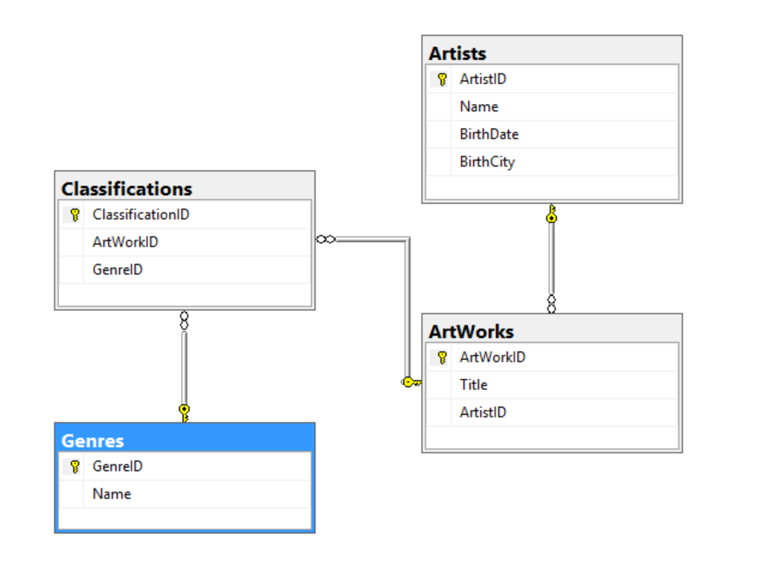

## Homework 8

This homework is the final from last year's class. It combines all of what we have worked on for the term in an application (that should be able to be completed in a relatively short amount of time)

## Links
1. [Home](https://ridethatcyclone.github.io)
2. [Assignment Page](http://www.wou.edu/~morses/classes/cs46x/assignments/HW8.html)
3. [Code Repository](https://github.com/ridethatcyclone/CS460/tree/master/HW8) <!-- ADD THIS ABBY!!!!! -->

### Setting up the database

The first thing I had to do was set up my database. We were given [this](http://www.wou.edu/~morses/classes/cs46x/assignments/HW8_tables.html) page to see the information and tables it needed, and from that I started working. The ER diagram I ended up with for my database is this:



Getting the UP and DOWN SQL scripts working how I wanted was slightly complicated, due to the presence of the foreign keys. It made the DROP script in particular a little complicated, because I had to delete the tables in a specific order to make sure I didn't muck up another table.

Creating the tables:

```SQL
CREATE TABLE dbo.Artists (
	ArtistID INT IDENTITY(1,1) NOT NULL,
	Name NVARCHAR(50) NOT NULL,
	BirthDate NVARCHAR(10) NOT NULL,
	BirthCity NVARCHAR(128) NOT NULL,

	CONSTRAINT[PK_dbo.Artists] PRIMARY KEY CLUSTERED (ArtistID ASC)
);

CREATE TABLE dbo.ArtWorks (
	ArtworkID INT IDENTITY(1,1) NOT NULL,
	Title NVARCHAR(128) NOT NULL,
	ArtistID INT NOT NULL,

	CONSTRAINT[PK_dbo.ArtWorks] PRIMARY KEY CLUSTERED (ArtworkID ASC),
	CONSTRAINT[FK_dbo.ArtWorks] FOREIGN KEY (ArtistID) REFERENCES Artists(ArtistID)
		ON DELETE CASCADE
		ON UPDATE CASCADE
);

CREATE TABLE dbo.Genres (
	GenreID INT IDENTITY(1,1) NOT NULL,
	Name NVARCHAR(64),

	CONSTRAINT[PK_dbo.Genres] PRIMARY KEY CLUSTERED (GenreID ASC)
);

CREATE TABLE dbo.Classifications (
	ClassificationID INT IDENTITY(1,1) NOT NULL,
	ArtworkID INT NOT NULL,
	GenreID INT NOT NULL,

	CONSTRAINT[PK_dbo.Classifications] PRIMARY KEY CLUSTERED (ClassificationID ASC),
	CONSTRAINT[FK1_dbo.Classifications] FOREIGN KEY (ArtworkID) REFERENCES ArtWorks(ArtworkID)
		ON DELETE CASCADE
		ON UPDATE CASCADE,
	CONSTRAINT[FK2_dbo.Classifications] FOREIGN KEY (GenreID) REFERENCES Genres(GenreID)
		ON DELETE CASCADE
		ON UPDATE CASCADE
);
```

Then I added the data in, which is still very simple to do and can be referenced also in an earlier lab:

```SQL
INSERT INTO dbo.Artists(Name, BirthDate, BirthCity) VALUES
	('M C Escher', '1898-06-17', 'Leeuwarden, Netherlands'),
	('Leonardo Da Vinci', '1519-05-02', 'Vinci, Italy'),
	('Hatip Mehmed Efendi', '1680-11-18', 'Unknown'),
	('Salvador Dali', '1904-05-11', 'Figueres, Spain')

INSERT INTO dbo.ArtWorks(Title, ArtistID) VALUES
	('Circle Limit III', 1),
	('Twon Tree', 1),
	('Mona Lisa', 2),
	('The Vitruvian Man', 2),
	('Ebru', 3),
	('Honey Is Sweeter Than Blood', 4)

INSERT INTO dbo.Genres(Name) VALUES
	('Tesselation'),
	('Surrealism'),
	('Portrait'),
	('Renaissance')

INSERT INTO dbo.Classifications(ArtworkID, GenreID) VALUES
	(1, 1),
	(2, 1),
	(2, 2),
	(3, 3),
	(3, 4),
	(4, 4),
	(5, 1),
	(6, 2)

GO
```

The down script is much shorter, thankfully. I did have to drop the tables in a specific order due to the foreign keys, but it wasn't a hard one to figure out. Just go from most dependencies to the least!

```SQL
DROP TABLE IF EXISTS dbo.Classifications
DROP TABLE IF EXISTS dbo.ArtWorks
DROP TABLE IF EXISTS dbo.Genres
DROP TABLE IF EXISTS dbo.Artists
```

And there! Database created and seeded. Onto making it all pretty...

### Prettying up the HTML and CSS

The first page I worked on was the index page. I didn't go too far off the rails with the layout, I kept the auto-generated navbar and just made a simple two-column layout for the main body. The basic framework is:

```HTML
@model IEnumerable<HW8.Controllers.Genre>

@{
	ViewBag.Title = "Home";
}

<div class="container">
	<div class="row">
		<div class="col-md-6">
			<h2>Welcome</h2>
			<hr />
			<p>Paragraphs here...</p>
			<div id="genresTable">
				<div class="btn-group">
				</div>
				<div id="out">
				</div>
			</div>
		</div>
		<div class="col-md-6 imgcol">
			
		</div>
	</div>
</div>

<script type="text/javascript" src="~/Scripts/myscript.js"></script>
```

I had to link my @model to my controller folder, despite the models being in the model folder. They originally generated in the controllers folder for some reason, and even after I moved them the HTML still acted like they were in there. I imagine one day that'll trip up, but until then, it seems to work as is.

Then I styled it, very minimally (mostly just to center everything)

```css
#imgcol {
	overflow:hidden;
	height:600px;
}

#homeImg {
	margin-top:10%;
	width:80%;
}

#genresTable {
	text-align:center;
}
```

In the shared layout, all I did was change the links in the navbar to fit my page. Otherwise I left it exactly as it was generated. And there! My basic layout and intro page is complete!

To make the pages to display the database information, I just used Visual Studio's auto generated CRUD.

The steps for this are:
* Right click on the project
* Click Add -> New Scaffolded Item...
* MVC 5 Controller with views, using Entity Framework
* Select the model class, the data context, and enter a controller name
* Once it's all generated, move everything into the correct folders and you're good to go!

For these pages I deleted all the stuff I didn't need (everything but the List for most of the sections). Then I checked that it all worked, and it did! I had to do a small amount of editing just to make sure my display names showed up correctly and my dates were formatted nicely. But otherwise the display section was good to go.

### Checking attributes

The way I checked attributes is not probably the way I'd recommend doing it in the real world, but for the purposes of this project it worked fine. Firstly, I just set the parameters in the model classes ([Required], for instance). Then to double check I went in the controller for my Artists/Edit and added a whole lot of if statements.

Yeah, not the best way of doing it, but it works, which is all I really wanted!

```cs
[HttpPost]
[ValidateAntiForgeryToken]
public ActionResult Edit([Bind(Include = "ArtistID,Name,BirthDate,BirthCity")] Artist artist)
{
	//Check to make sure birthday was entered
	if (string.IsNullOrEmpty(artist.BirthDate)
		return View(artist);
	else
	{
		//Checking to make sure data is valid (not in the future)
		string[] datePart = artist.Birthdate.Split('-');
		if (datePart.Length > 10)
			return View(artist);
		int year = 0, month = 0, day = 0;
		int.TryParse(dateParse[0], out year);
		int.TryParse(dateParse[1], out month);
		int.TryParse(dateParse[2], out day);
		if (year > DateTime.Now.Year || month > 12 || day > 31)
			return View(artist);
	}

	//Check to make sure name isn't empty
	if (string.IsNullOrEmpty(artist.Name))
		return View(artist);
	//Check to make sure name is no longer than 50 characters
	else if (artist.Name.Length > 50)
		return View(artist);
	//Check to make sure birth city isn't empty
	else if (string.IsNullOrEmpty(artist.BirthCity))
		return View(artist);
	else if (ModelState.IsValid)
	{
		db.Entry(artist).State = EntityState.Modified;
		db.SaveChanges();
		return RedirectToAction("Index");
	}
	return View(artist);
}
```

### Wrestling with AJAX

Then, onto AJAX. My nemesis. This was really difficult for me. I understand Javascript and JQuery pretty well, but I struggled a lot with the ajax. I think a lot of my issues were pretty nitpicky to be honest (spelling things wrong, linking to the wrong controller, etc). I'm just glad it works now!

So here's the code in my index page to generate my buttons:

```html
<div id="genresTable">
	<div class="btn-group">
		@foreach (var item in Model.ToList())
		{
			<button class="btn btn-default" onclick="ajaxDisplay('@item.GenreID')">@item.Name</button>
		}
	</div>
	<div id="out">
	</div>
</div>
```

The div with id out is where my table will be generated once a button is clicked.

So then next came the actual javascript code.

```js
function ajaxDisplay(id) {
	var source = '/Home/Genre';
	console.log(source);
	$.ajax({
		type: 'GET',
		dataType: 'json',
		data: { id : id },
		url: source,
		success: displayResults,
		error: errorOnAjax
	});
}

function displayResults(data) {
	$('#out').empty();

	var item = document.getElementById("out");
	data.arr.forEach(function(item) {
		$('#out').append(item);
	});
}

function errorOnAjax() {
	console.log("Error");
}
```

This was fairly straightforward, once I figured out how ajax worked. I got a lot of help from my classmates for this part and am very thankful to them. For the actual ajax bit, I used a GET instead of a POST because for that part I only need to retrieve the information, I'm not posting it yet. I pass the GenreID to the controller Home/Genre and on a successful run I display the results, on a failure I just output that there was an error.

This means that next I needed to get the controller working. This one referenced both my classmates and a lot of youtube videos.

```cs
public JsonResult Genre(int id)
{
	var artworks = db.Genres.Find(id)
			.Classifications
			.ToList()
			.OrderBy(x => x.ArtWork.Title)
			.Select(a => new { aw = a.ArtworkID, awa = a.ArtWork.ArtistID })
			.ToList();
	string[] artworkCreator = new string[artworks.Count()];

	for (int i = 0; i < artworkCreator.Length; ++i)
	{
		artworkCreator[i] = $"<ul>{db.Artworks.Find(artworks[i].aw).Title} by {db.Artists.Find(artworks[i].awa).Name}</ul>";
	}

	var data = new { arr = artworkCreator };

	return Json(data, JsonRequestBehavior.AllowGet);
}
```

Basically this just pieces together my list of artworks and their artists that fall under the selected classification, adds them to an array, and outputs that array as a Json object. Phew.

And with that, it's all done!

Gosh, that was a lot.
