## Homework 9

This assignment is very simply deploying the application we previously created in Homework 8 using Azure.

## Links
1. [Home](https://ridethatcyclone.github.io)
2. [Homework 8](https://ridethatcyclone.github.io/CS460/HW8)
3. [Live Site](http://hornera-cs460hw89.azurewebsites.net/)

### How to do it

1. Create a Database on Azure: Decide on a name and a resource group (in this case I created one, but next time I can just use the same one if I want). The options are all fairly straightforward
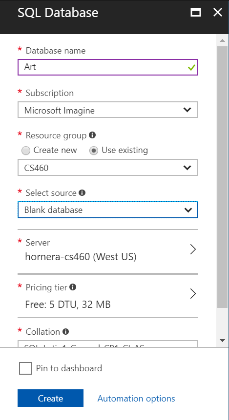
2. Connect to the database in Microsoft SQL Server Management Studio. The server name can be found on Azure, then login using the credentials you set up in step 1. You may have to adjust the firewall to allow access (it gave me this option within MSSMS).
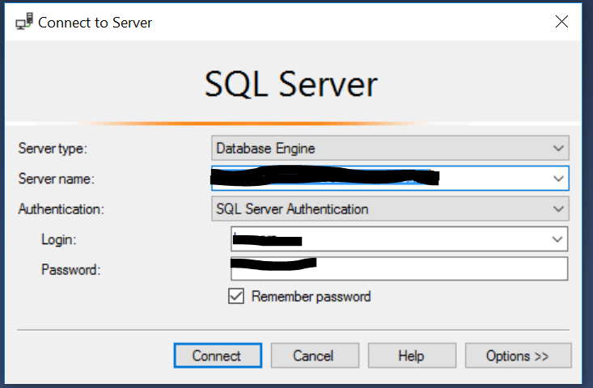
3. Open up the UP.SQL file made in Homework 8 (Simply CTRL+O) and run it to seed the database. NOTE: Make sure you're connected to the correct database! Azure also auto-generates a 'master' database. I was using 'artInfo', and luckily caught this before running my UP script.
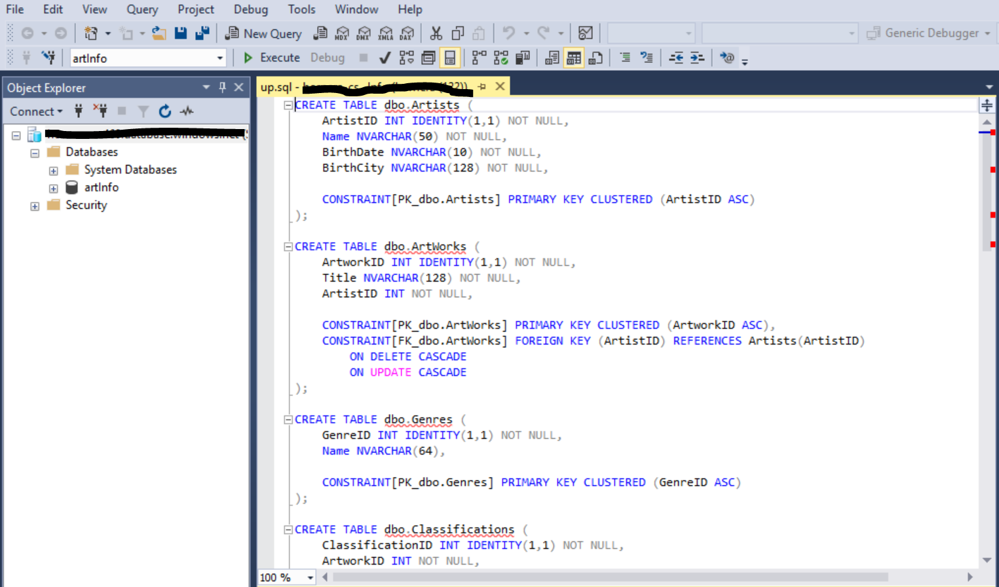
4. Back on Azure, create a Web App. This is under App Services -> Web App. You can use the same resources you already generated.
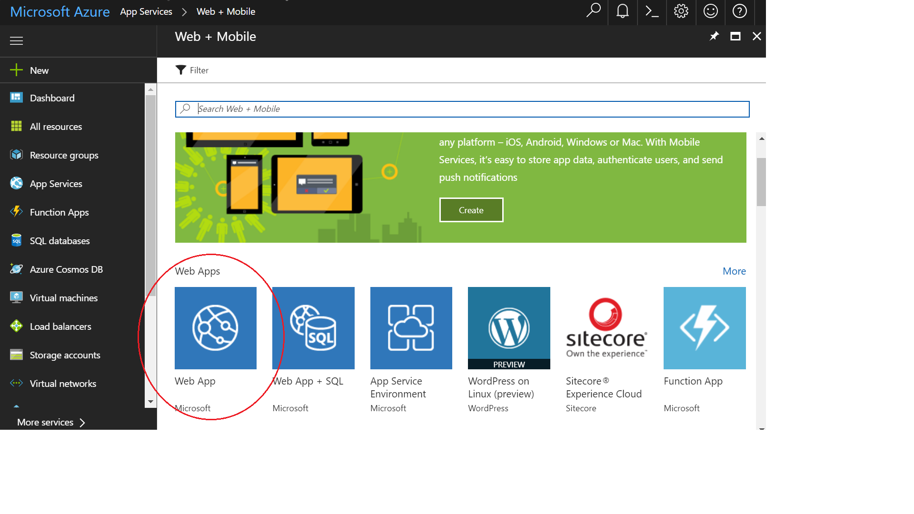
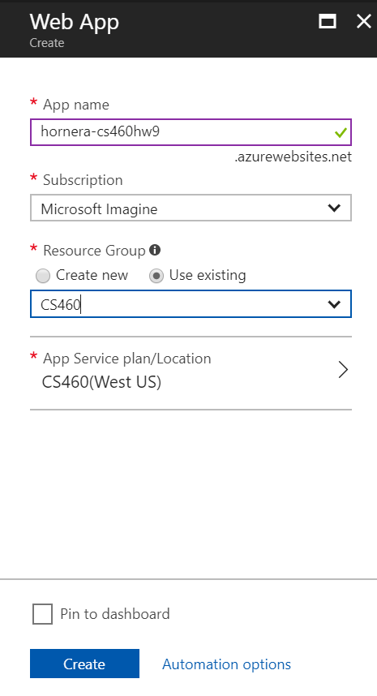
5. Now over to Visual Studio. Right click on the project and select "Publish...". You'll select Azure App Service and select existing. Click publish and find your project in the popup. Select it and click OK. This part will take a minute.
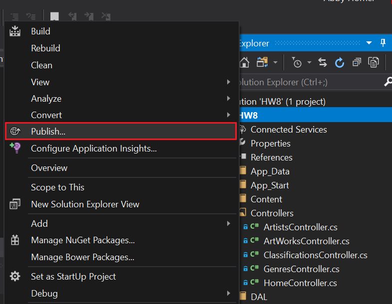
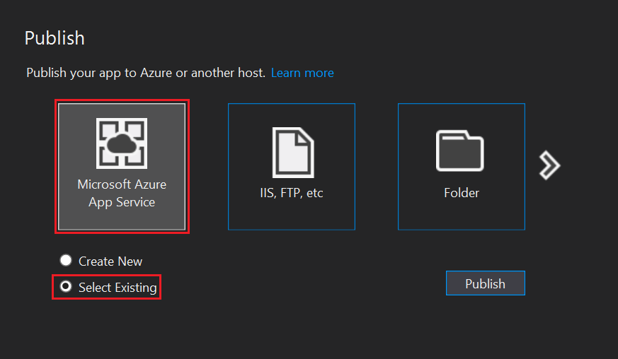
6. Find the connection string in Azure (under SQL Databases, then choose the database you're using) and add it to the Web App (Under Settings). Note that you must edit this string slightly (as it needs login credentials) - don't worry, Azure hides this for you.
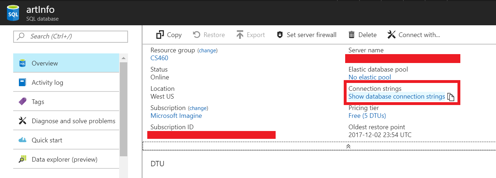
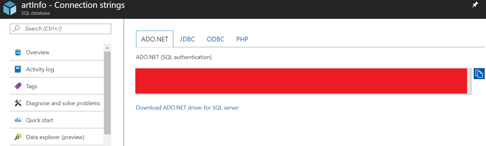
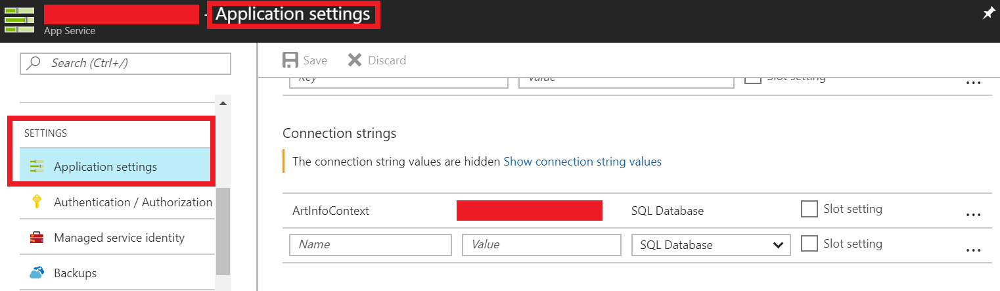
7. You should be good to go!
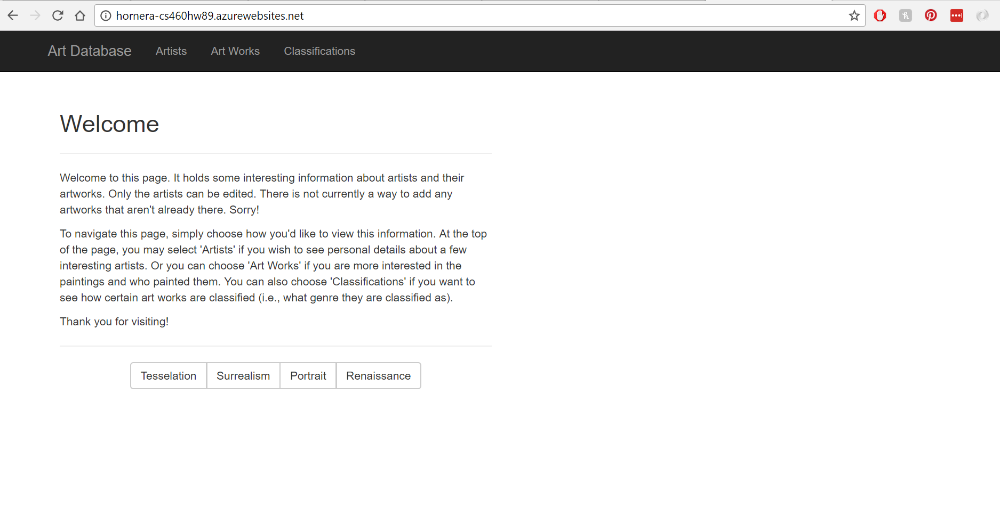
