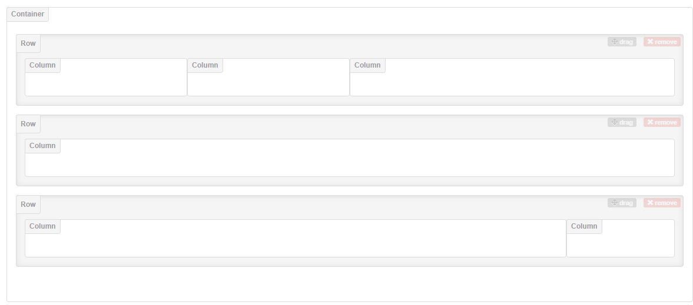

## CSS
CSS uses a sort of key:value structure, applied to selectors outside the brackets. An example:
```CSS
p {
    font-size:12px;
    color:red;
}
```
This styles all paragraph elements to have a font size of 12 pixels and be red.
```CSS
/* You can select simply elements */
p {
    . . .
}

/* Or elements by ID */
#id {
    . . .
}

/* Or by class */
.class {
    . . .
}

/* Or a combination */
p .center {
    . . .
}
```

CSS stands for 'Cascading Style Sheets' - the cascading is what defines the order of precedence. That is, which styles will take effect when multiple overlapping ones are specified for one element. An inline style (defined within the HTML tag) has highest precedence, followed by internal and external style sheets, followed by browser default. In the style sheets, the style sheet loaded last takes precedence.

### Useful CSS Properties

As always, W3Schools is a crazy useful resource. A lot of these notes are what I've learned going through their lessons.

```CSS  
p {
    /* Background Properties */
    background-color: #ccc;
    background-position: right top;
    background-repeat: repeat-x; /* repeats horizontally */
    background-image: url("image.jpg");

    /* Border Properties */
    border-style: dashed;
    border-width: 2px;
    border-radius: 0px;
    border-color: green;

    /* Margin Properties */
    margin: 10px 15px 5px 20px;
        /* Makes the margins as:
        top: 10px
        right: 15px
        bottom: 5px
        left: 20px
        but they can also be done separately */
    margin: auto

    /* Text Properties */
    text-align: center;
    text-decoration: none;
    text-transform: uppercase;
    text-indent: 10px;
    letter-spacing: 5px;
    line-height: 1.5;
    direction: rtl;
    word-spacing: 10px;
    font-family: "Times New Roman", Times, serif;

    /* Display Properties */
    display: none;
    display: block;
    display: inline;
}
```

You can also use special indicators in the selectors to specify a *behavior* that you want to edit. That is to say, what you want something to look like when, for instance, it is clicked on.

```CSS
a:link {
    color:red;
}

a:hover {
    color:blue;
}

a:visited {
    color:green;
}

a:active {
    color:orange;
}
```

You can also specify the `position` of an element:
+ `static`: By default, HTML elements are positioned this way.
+ `relative`: The element is positioned relative to where it normally would be
+ `fixed`: The element stays in the same place even if the page is scrolled.
+ `absolute`: The element is positioned in relation to its nearest ancestor
+ `sticky`: Positioned relative to the scroll


## Bootstrap

Bootstrap uses a 12-column wide system of dividing up the page. This can be split up into pretty much any way the web designer chooses, by dividing rows and columns as necessary to achieve the layout desired.

```HTML
<body>
    <div class="container">
        <div class="row">
            <div class="col-md-3">
            </div>
            <div class="col-md-3">
            </div>
            <div class="col-md-6">
            </div>
        </div>
        <div class="row">
            <div class="col">
            </div>
        </div>
        <div class="row">
            <div class="col-md-10">
            </div>
            <div class="col-md-2">
            </div>
        </div>
    </div>
</body>
```

Using the layout builder found [here](http://www.layoutit.com/build), this is what the above layout would look like (with no content added yet):


